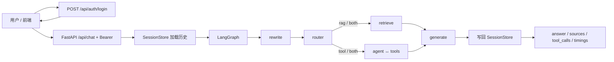

# 企业新员工知识助手（RAG + Agent）

企业内部制度问答助手：制度类问题走 RAG 检索，计算与结构化参数查询走 Agent 工具；面向校招/实习的求职作品集项目。


---

## 功能特性

- Hybrid RAG：向量召回与 BM25 关键词召回经 RRF 融合，默认取 Top-K，可切换纯向量对比。
- LangGraph 路由分诊：按问题类型走纯检索、纯工具或两者结合。
- 工具抽象与注册表：年假计算、制度参数查询统一经 `tools/registry` 发现，Agent 不绑定具体实现。
- 多轮会话：SessionStore 按 `session_id` 持久化历史；检索前将依赖上文的追问改写为可独立检索的完整问题。
- 上下文预算与历史摘要：历史 / 检索 / 工具结果分桶限字符；超长会话对更早轮次做摘要。
- 工号密码登录：签发 Bearer token，角色由服务端决定，客户端不可伪造。
- 文档密级 ACL：按登录身份（实习生 / 员工 / 管理员）过滤公开 / 内部 / 机密文档。
- 标准场景评测：覆盖制度问答、工具、混合、拒答、同会话多轮，可导出报告。
- Web 演示页：登录后页头展示姓名 / 工号 / 身份，会话记忆持久化。

---

## 架构总览



主链路与 `app/agent/graph.py` 一致：先登录拿到 token；聊天请求带 Bearer，服务端从 token 取角色后，由 SessionStore 加载该会话历史与画像，再进入状态图 `rewrite → router → retrieve 和/或 agent↔execute_tools → generate`，结束后写回本轮问答，返回答案与元数据。

分层职责：

- **Auth**（`app/auth/`）：工号密码校验、HMAC token、FastAPI Depends；角色不信任请求体。
- **API**（`app/api/routes.py`）：参数校验、HTTP 适配；业务委托给 `run_agent` / `ingest`。
- **Agent**（`app/agent/`）：LangGraph 状态图编排路由、工具循环与最终生成；状态字段在 `state.py` 用 TypedDict 显式定义。
- **RAG**（`app/rag/`）：文档加载、切分、向量库、BM25、检索与入库；检索模块与 Agent 编排解耦，可单独调用与测试。
- **Tools**（`app/tools/`）：工具经 `tools/registry` 动态获取，Agent 逻辑不直接 import 具体工具实现。
- **Memory**（`app/memory/`）：跨轮对话由 SessionStore 按 `session_id` 持久化；与 LangGraph Checkpointer 职责不同，本项目不将其作为多轮记忆方案。

---

## 核心策略 / 设计说明

本节说明关键设计取舍、默认约束与失败降级方式，便于核对代码与面试讲解。

### 会话记忆与查询改写

跨轮「聊过什么」由 SessionStore（SQLite）按 `session_id` 管理，而不是依赖图内断点存储。

- 持久化内容包括完整问答历史、轻量用户画像（如已透露的入职日期）以及可选的会话摘要。
- 每一轮仍是一次完整的图执行：`run_agent` 在 invoke 前加载历史与画像，结束后写回本轮问答；跨轮状态不依赖 LangGraph Checkpointer。
- 对「那报销上限呢」这类依赖上文的追问，检索前结合近期历史，将其改写为可独立检索的完整问题（Query Rewrite）。
- 改写失败或未启用时回退为原始问题，不中断主流程。

### 上下文预算与历史摘要

模型上下文有限；在组装最终 Prompt 前对各类材料做分桶限流，避免无关长文占满窗口。

- 最近完整问答轮以原文注入 Prompt（默认约 6 轮，由 `MAX_HISTORY_TURNS` 配置）；历史摘要也按同一窗口：仅当消息条数超过该窗口（轮数×2）时，才对更早轮次做 LLM 摘要，摘要与最近原文一并提供；摘要失败则仍使用最近轮次，保证可用性。
- 历史对话、检索片段、工具结果各自有独立字符上限（默认约 2000 / 3000 / 1500）；超限时历史保留尾部（最近内容），检索按相关度从高到低装入直至预算用尽。
- 预算裁剪发生在组装最终 Prompt 之前，不改动检索模块本身，便于单独测试检索质量。

### Hybrid 检索

制度文本既有语义相近表述，也有「报销」「30 天」等专名与数字；默认用两路召回再融合。

- 检索默认使用 Hybrid：向量相似度召回与 BM25 关键词召回经 RRF（倒数排名融合）合并后取 Top-K。
- 可通过 `RETRIEVAL_MODE=vector` 切换为纯向量，便于对比 Hybrid 收益。
- 向量分数低于阈值的片段不进入上下文；入库时同步刷新关键词索引，保证两路语料一致。
- 中文关键词侧采用轻量切分（字与二元组为主），避免引入过重分词依赖。
- 检索与生成分离：`rag/retriever.py` 可独立调用；回答生成在后续节点完成。更多细节见 [docs/retrieval.md](docs/retrieval.md)。

### Agent 路由与兜底

先分诊再执行，并为失败路径保留可恢复行为，避免异常直接导致服务崩溃。

- 三种路由：`rag`（纯检索，制度原文问答）、`tool`（纯工具，如按入职日期算年假）、`both`（检索与工具结合）。
- 单次对话工具调用上限为 3 轮（`MAX_TOOL_ROUNDS`）；参数解析失败或工具异常时，将错误以 ToolMessage 回喂模型重试或改路径。
- 工具轮次达上限仍有未执行调用时置 `degraded`，回答附不确定提示。
- 检索结果为空且无可用工具结果时，Prompt 要求如实说明未找到相关信息，禁止编造制度条款。
- 路由 LLM 失败或不合法输出时降级为 `both`；生成失败返回固定道歉话术。
- 工具统一继承抽象基类，经注册表发现；Agent 只依赖 `get_all_tools` / `get_tool`。

### 登录鉴权与文档密级过滤

企业知识常有公开 / 内部 / 机密之分；本项目用**登录身份**做演示级 ACL（非 SSO / LDAP）。

- **登录**：工号 + 密码 → 服务端校验 `data/users.json` → 签发 HMAC Bearer token；聊天接口必须带 `Authorization`。
- **角色来源**：token / 用户库（`intern` / `employee` / `admin`），**不再**接受请求体传 `role`，客户端无法伪造权限。
- 文档密级：`public` < `internal` < `confidential`；角色可读上限：实习生仅公开、员工至内部、管理员含机密。
- 过滤发生在检索返回前；制度参数类工具（`policy_lookup`）遵循同一规则；工具侧 `user_role` 由 Agent 注入 context，不由 LLM 传参。
- 密级映射见 `data/doc_access.json`；变更后需重新入库。
- **Web** 走登录鉴权；**CLI**（`scripts/agent_demo.py --role`）仍可直接指定角色做联调。

### 标准场景评测

用固定题集做回归，而不是依赖单次演示碰巧答对。

- 题型覆盖：制度问答（rag）、工具调用（tool）、检索+工具（both）、应拒答（refuse）、同会话多轮追问（multi_turn）。
- 判定维度：路由是否落在允许范围、是否调用预期工具、答案是否含关键信息、拒答是否出现约定表述、来源是否相关等。
- 路由允许合理容差（如 `rag` / `both`），因分诊由模型完成、存在非确定性。
- 无 API Key 时可做结构校验（`--offline`）；有 Key 可全量跑并导出按题型分组的报告。
- 本地一次全量结果约 **22/23（95.7%）**，拒答题型中有一条话术未命中约定关键词；详见 [docs/eval_report.md](docs/eval_report.md)。

---

## 技术栈

| 类别 | 选型 |
|------|------|
| 语言 | Python 3.10+ |
| Agent 编排 | LangGraph（StateGraph） |
| RAG | LangChain |
| 向量库 | Chroma（本地持久化） |
| Web | FastAPI + uvicorn |
| Embedding | 本地 `BAAI/bge-small-zh-v1.5` 或 API（可切换） |
| LLM | OpenAI 兼容接口（默认 DeepSeek） |
| 前端 | HTML / CSS / JS |
| 测试 | pytest |
| 日志 | 标准库 logging |

敏感配置（`LLM_API_KEY`、`LLM_BASE_URL` 等）从环境变量读取，经 `app/config.py` 统一管理；新增配置项需同步更新 `.env.example`。

---

## 快速开始

### 1. 创建环境

```bash
conda env create -f environment.yml
conda activate enterprise-knowledge-agent
# 或：pip install -r requirements.txt
```

### 2. 配置环境变量

```powershell
# Windows PowerShell
Copy-Item .env.example .env
```

编辑 `.env`，至少填写 `LLM_API_KEY`。其余项见下文「关键配置」与 `.env.example`。

### 3. （可选）生成样例 Word / PDF

```bash
python scripts/generate_sample_docs.py
```

### 4. 文档入库

支持 **md / txt / pdf / docx**。入库会清空并重建向量库，并刷新关键词索引（Hybrid 依赖）。密级映射见 `data/doc_access.json`。扫描件 OCR 不在本项目范围。

```bash
python scripts/ingest.py --rebuild
```

### 5. 启动服务

```bash
uvicorn app.main:app --reload --host 127.0.0.1 --port 8000
```

- 聊天页：http://127.0.0.1:8000/（需先用工号密码登录）
- Swagger：http://127.0.0.1:8000/docs

演示账号（密码均为 `demo123`，见 `data/users.json`）：

| 工号 | 姓名 | 身份 |
|------|------|------|
| E1001 | 张小明 | 员工 |
| I2001 | 李实习 | 实习生 |
| A9001 | 王管理 | 管理员 |

### 6. 演示问题示例

| 问题 | 预期行为 |
|------|----------|
| 报销要在多久内提交 | 走检索，引用报销制度，回答约 30 天 |
| 我的年假有几天 | 走工具；登录用户画像含入职日期时可少问一遍 |
| 我入职3年了，年假几天，公司年假政策是什么 | 检索 + 工具结合 |
| （同一会话）那报销上限呢 | 改写后检索报销相关，不丢上文 |
| 今天天气如何 | 如实告知知识库中未找到相关信息 |
| 用 I2001 登录后问报销时限 | 实习生密级过滤后，内部文档在检索侧不可见 |

命令行单轮 / 多轮（CLI 用 `--role`，不走 Web 登录）：

```bash
python scripts/agent_demo.py "我2023年7月入职，年假有几天"
python scripts/agent_demo.py "那报销上限呢" --session-id <上一步输出的 session_id>
python scripts/agent_demo.py "报销要在多久内提交" --role intern
```

---

## 关键配置

常改项摘录如下；完整列表见 [`.env.example`](.env.example)。

| 变量 | 含义 | 默认倾向 |
|------|------|----------|
| `LLM_API_KEY` / `LLM_BASE_URL` / `LLM_MODEL_NAME` | LLM 密钥与兼容接口 | DeepSeek 兼容 |
| `EMBEDDING_PROVIDER` / `EMBEDDING_MODEL_NAME` | Embedding 本地或 API | local + bge-small-zh |
| `RETRIEVAL_MODE` | `hybrid` 或 `vector` | hybrid |
| `RETRIEVAL_TOP_K` / `RETRIEVAL_SCORE_THRESHOLD` | 召回数量与低分过滤 | 4 / 0.3 |
| `MAX_TOOL_ROUNDS` | 单次对话工具调用上限 | 3 |
| `MAX_HISTORY_TURNS` / `ENABLE_QUERY_REWRITE` | 最近原文轮数（亦为摘要保留窗口）与是否改写 | 6 / true |
| `MAX_HISTORY_CHARS` 等 | 分桶字符预算 | 见 `.env.example` |
| `ENABLE_ACCESS_CONTROL` | 是否启用密级过滤 | true |
| `AUTH_SECRET_KEY` | token HMAC 签名密钥 | 开发默认值，生产务必覆盖 |
| `AUTH_TOKEN_EXPIRE_HOURS` | token 有效小时数 | 24 |
| `USERS_FILE` | 演示用户花名册 | `data/users.json` |

---

## 项目结构（节选）

```
app/
  main.py                 # FastAPI 入口，挂载 /api 与前端静态页
  config.py               # 配置（.env → Settings）
  llm.py                  # 共享 Chat 模型工厂
  auth/                   # 登录、token、Depends（角色由服务端决定）
  api/routes.py           # health / chat / chat/stream / ingest
  api/auth_routes.py      # login / me
  memory/                 # SessionStore、查询改写、上下文预算、历史摘要
  rag/                    # 加载、切分、向量库、BM25、检索、密级、入库
  agent/                  # 状态图、TypedDict 状态、Prompt
  tools/                  # 基类、年假计算、制度参数查询、注册表
  utils/                  # logging
frontend/                 # 登录 + 聊天 UI（token / session_id 持久化）
data/
  raw_docs/               # 模拟制度文档（含机密样例）
  users.json              # 演示账号（工号 / 姓名 / 角色 / 密码哈希）
  doc_access.json         # 文件名 → 密级
  policy_params.json      # 结构化制度参数（供工具查询）
  eval/                   # 标准场景评测集
scripts/                  # 入库 / 演示 / 评测 / 样例文档生成
tests/                    # pytest
docs/                     # 检索说明、评测报告、面试提纲等
```

---

## API

| 方法 | 路径 | 说明 |
|------|------|------|
| GET | `/api/health` | 健康检查（公开） |
| POST | `/api/auth/login` | 工号+密码登录，返回 Bearer token 与用户信息 |
| GET | `/api/auth/me` | 当前登录用户（需 Bearer） |
| POST | `/api/chat` | 同步问答（需 Bearer）；可选 `session_id`；角色来自 token |
| POST | `/api/chat/stream` | SSE **伪流式**（需 Bearer）；Agent 跑完后按块推送，非真 token 流 |
| POST | `/api/ingest` | 触发文档重新入库并刷新关键词索引（本阶段不强制登录） |

---

## 测试与评测

```bash
pytest -q
python scripts/run_eval.py --offline                          # 无 Key：校验评测集结构
python scripts/run_eval.py --output docs/eval_report.md       # 有 Key：全量并写报告
```

评测覆盖制度问答、工具、混合、拒答、同会话多轮；报告含按题型分组的通过率与失败用例说明。数字以 [docs/eval_report.md](docs/eval_report.md) 当前内容为准（近期全量约 22/23，95.7%）。

---

## 文档索引

- [docs/retrieval.md](docs/retrieval.md) — Hybrid 检索模式、RRF、索引刷新与分词说明
- [docs/eval_report.md](docs/eval_report.md) — 标准场景评测报告（可由脚本刷新）
- [docs/chunking_comparison.md](docs/chunking_comparison.md) — 切分策略对比笔记

---

## 已知局限与后续方向

- 已实现工号密码登录与服务端 token 鉴权；演示账号存本地 JSON，**非**企业 SSO / LDAP / OAuth。
- `/api/chat/stream` 为伪流式（整段生成后再分块推送），非真 token 流式。
- Embedding 本地模型首次加载有冷启动成本；扫描件 PDF 无 OCR。
- 制度参数工具读取本地 `policy_params.json`，非真实业务库。
- 未实现外部工具协议适配（如 MCP）/ 人机确认中断；工具抽象仅为后续扩展预留边界。
- `/api/ingest` 本阶段未强制管理员登录；密级映射或原始文档变更后需重新入库：`python scripts/ingest.py --rebuild`。

---

## License

暂未添加开源许可证。
